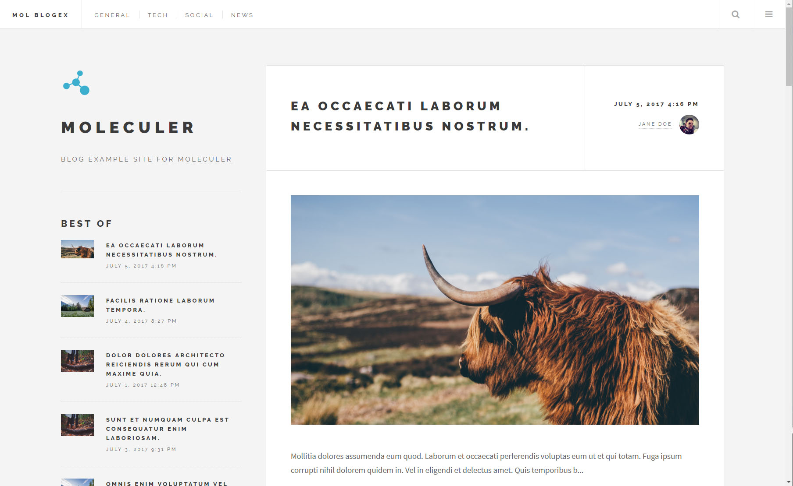
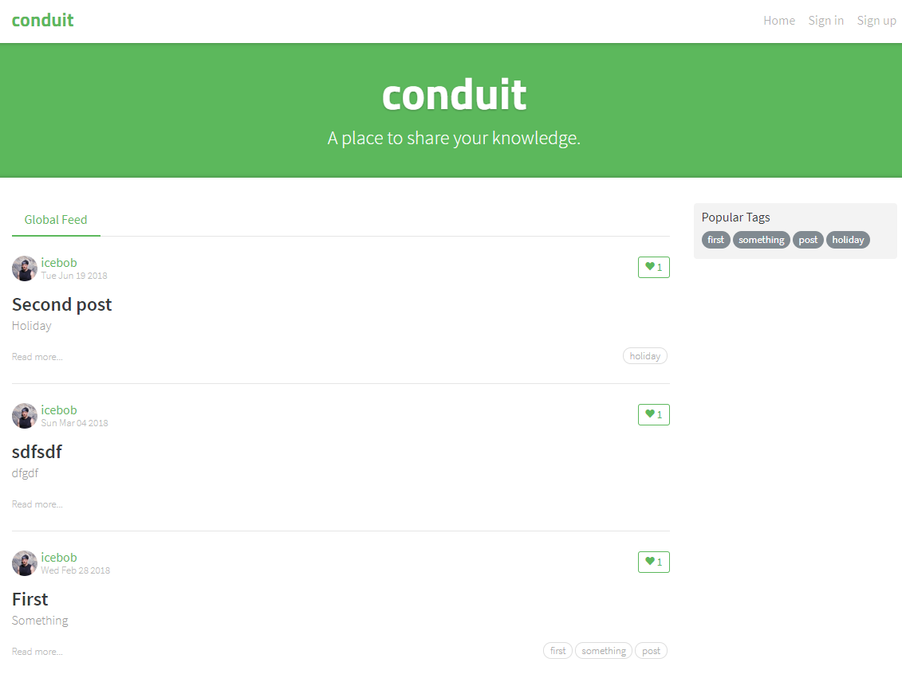

# moleculer-examples
Official examples for Moleculer microservices framework

## [Blog site](blog/)

## [RealWorld.io example backend app](conduit/)

# License
This repo is available under the [MIT license](https://tldrlegal.com/license/mit-license).

# Contact
Copyright (c) 2016-2020 MoleculerJS

 