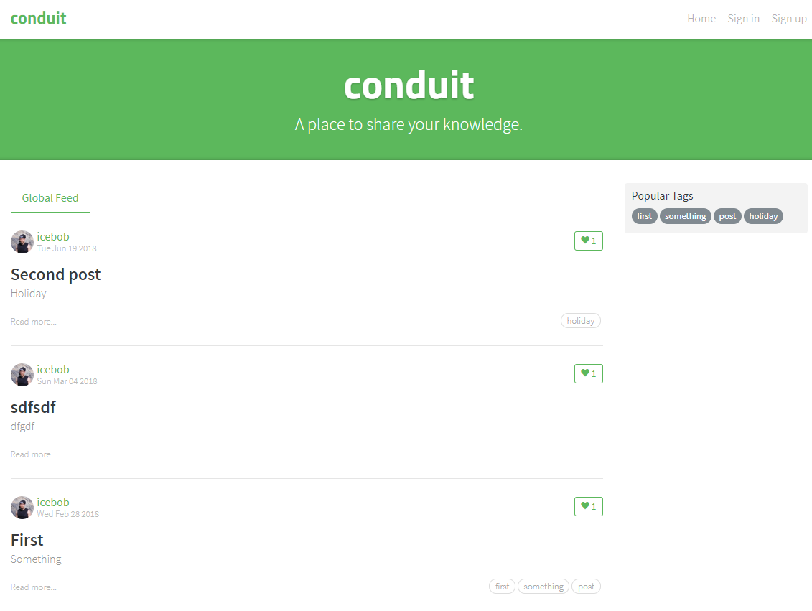

# moleculer-examples

Official examples for the [Moleculer](https://moleculer.services) microservices framework.

Every example is a self-contained project: `cd` into it, `npm install`, read its README and run it. All of them target **Moleculer 0.15** and **Node.js 22+**. Most need a NATS server on `localhost:4222` (`docker run -d --rm -p 4222:4222 nats:2`); the READMEs say which ones need more.

## Topic examples (2026)

Each directory is the companion code for one article on the Moleculer blog. The article's snippets and outputs come from these files, and the `run.sh` scripts reproduce them end to end.

| # | Example | Shows |
|---|---------|-------|
| 01 | [Node.js microservices without Kubernetes](01-microservices-without-kubernetes/) | one process → many processes → scale a copy; resilience as broker options; `moleculer-web` gateway; docker-compose deployment |
| 02 | [Moleculer vs NestJS](02-moleculer-vs-nestjs/) | the same service in both frameworks, side by side, with a second instance and a missing service |
| 03 | [Moleculer with TypeScript](03-typescript/) | shared contract file, schema style vs class style, typed caller, `tsx` dev run and compiled run |
| 04 | [From a modular monolith to microservices](04-monolith-to-microservices/) | Express monolith → in-process services → extract one → split and scale, in three stages |
| 05 | [Service discovery and load balancing](05-service-discovery-and-load-balancing/) | registry, round robin, scaling and crashes with live traffic, strategies, TCP transporter without a broker |
| 06 | [Circuit breaker, retry and timeout](06-circuit-breaker-retry-timeout/) | retry, per-endpoint breaker with heal, timeout → failover → cut-off, distributed timeout budget, fallback, bulkhead |
| 07 | [Event-driven pub/sub with NATS, Kafka and Redis](07-event-driven-pubsub/) | emit vs broadcast, groups, context across hops, same code on three transporters, durable channels with retry + dead-letter |
| 08 | [Moleculer vs gRPC vs tRPC](08-moleculer-vs-grpc-trpc/) | the same service three ways against the same failures; tRPC gateway on a Moleculer node; gRPC service behind a Moleculer action |

## Full applications (Moleculer 0.14)

These older, larger examples were written for Moleculer 0.14 and have not been upgraded yet.

- [Blog site](blog/) — a blog with MongoDB, server-rendered views and a REST API. 
- [RealWorld.io example backend](conduit/) — the [RealWorld](https://realworld.io) "Conduit" API implemented as Moleculer services. 
- [tools/](tools/) — assorted community projects.

# License
This repo is available under the [MIT license](https://tldrlegal.com/license/mit-license).

# Contact
Copyright (c) 2016-2026 MoleculerJS

 
